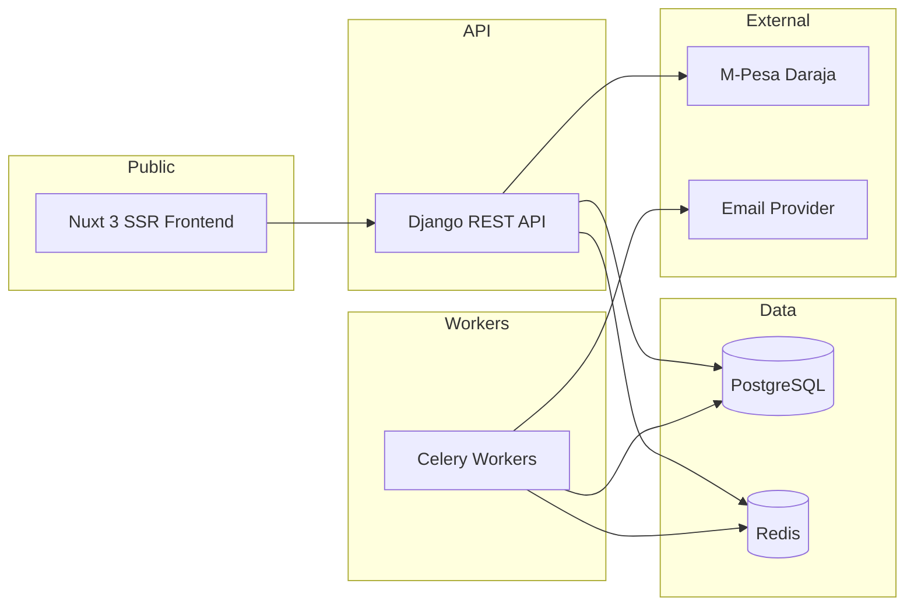

# AestheticOS

**The booking operating system for spa & aesthetics businesses.**

Full-stack monorepo for [Shee Aesthetics](https://github.com/ALEX-MUTHOMI/aesthetic-os): public portfolio gallery, appointment booking, M-Pesa checkout, staff operations, and an immutable billing ledger — Django 6, Nuxt 3 SSR, PostgreSQL, Redis, and Celery.

## Highlights

- Public portfolio gallery with a secure image pipeline (optimized variants; originals stay protected)
- Appointment booking with atomic holds and PostgreSQL overlap protection
- Safaricom M-Pesa (Daraja) checkout with webhook idempotency
- Immutable billing ledger kept separate from booking UI state
- Staff portal for schedule, bookings, gallery, and payments
- Guest booking, OTP flows, and public status polling
- CI with security scans, load tests, chaos testing, and Newman acceptance

## Stack

| Layer | Technology |
|-------|------------|
| Backend | Python 3.13, Django 6, DRF, Poetry |
| Frontend | Nuxt 3, Vue 3, Pinia, TypeScript |
| Data | PostgreSQL 16, Redis 7, Celery |
| Payments | M-Pesa Daraja STK + webhooks |
| Security | Turnstile, CSRF, rate limits, red-team test suite |
| Runtime | Docker, GitHub Actions |

## Architecture

Bounded contexts keep money, bookings, and presentation from collapsing into one module:

| Module | Responsibility |
|--------|----------------|
| **Bookings** | Catalog, availability, holds, lifecycle, gallery, staff workflows |
| **Checkout** | Payment orchestration, M-Pesa STK, webhooks, idempotency |
| **Billing** | Immutable ledger, settlements, financial audit events |
| **Core** | Auth, throttling, Celery, security headers, OpenAPI |



## Quick start

```bash
cp .env.example .env
docker compose up --build
```

- API: `http://localhost:8000`
- Frontend: `http://localhost:3000`

Use the example env files for local/staging. Never commit real secrets.

## Documentation

- [Backend architecture](docs/BACKEND_ARCHITECTURE.md)
- [Booking production blueprint](docs/BOOKING_APP_PRODUCTION_BLUEPRINT.md)
- [CI test matrix](docs/testing/CI_TEST_MATRIX.md)
- [Portfolio overview](showcase/README.md)

## Author

**Alex Muthomi** — [github.com/ALEX-MUTHOMI](https://github.com/ALEX-MUTHOMI)
