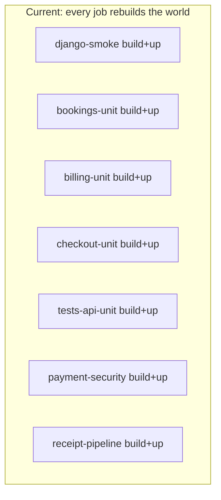
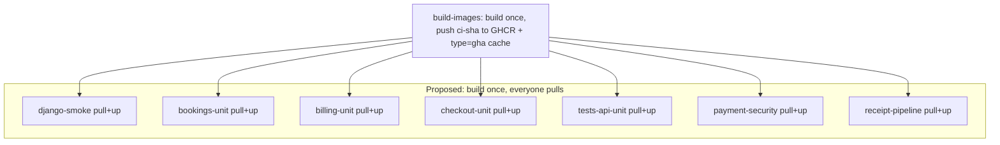

# CI Workflow Design — Cloudflare's model, our GitHub Actions, and how to be efficient

This is both a **teaching note** (how modern CI thinks about efficiency) and a
**design record** (why our pipeline is shaped the way it is, and the changes we
are making). It reads Cloudflare's ["CI is just a Workflow"](https://blog.cloudflare.com/ci-workflows/)
launch against our own `Secure Enterprise CI Pipeline`
([.github/workflows/ci.yml](../../.github/workflows/ci.yml)) and extracts the
transferable principles.

Related: [CI_TEST_MATRIX.md](../testing/CI_TEST_MATRIX.md),
[BRANCH_PROTECTION.md](./BRANCH_PROTECTION.md),
[SELF_HOSTED_RUNNER.md](./SELF_HOSTED_RUNNER.md),
[RELEASE_CHECKLIST.md](./RELEASE_CHECKLIST.md).

---

## 1. What Cloudflare shipped (and why it is interesting)

Cloudflare's post reframes a CI/CD pipeline as **just a Workflow**: instead of a
YAML file, you write TypeScript on **Cloudflare Workflows**, each step runs a
command in an isolated **Sandbox**, code is stored in **Artifacts** (R2-backed),
and a passing pipeline ends in `wrangler deploy`. The parts worth studying:

- **Install once, cache, reuse.** The `install` step's sandbox is snapshotted to
  R2; later steps (`lint`, `test`, `typecheck`, `build`) start from that
  snapshot instead of reinstalling. Dependencies are paid for once per run.
- **Parallel by default.** Steps are independent unless you wrap them in
  `Promise.all()`; concurrency is the default, not an opt-in.
- **Durable retries + restart-from-a-step.** Because it is a Workflow, every
  step has its own retry/timeout policy and persisted state. If only `lint`
  fails, you restart `lint` — not the whole pipeline.
- **Self-healing.** An optional Workers-AI `HealingAgent` catches a failed step,
  attempts a fix, and pushes it to a **fix branch** for a human to merge. The
  source run stays red; the verified fix lives elsewhere.
- **Observability.** Each run is a Workflow instance with per-step inputs,
  outputs, wall time, and CPU time in the dashboard.

### Why we are NOT migrating to it (yet)

- It is **private beta** and **Workers-centric** — the terminal step is
  `wrangler deploy`.
- Our money path is **Django + Nuxt in Docker**, promoted as **GHCR images**
  ([docker-compose.yml](../../docker-compose.yml),
  [deploy-staging.yml](../../.github/workflows/deploy-staging.yml)). Django does
  not deploy to a Cloudflare Worker.
- Our branch protection, environments, and fortress certification are already
  built on GitHub Actions ([BRANCH_PROTECTION.md](./BRANCH_PROTECTION.md)).

**Decision:** GitHub Actions stays the system of record for the money path. We
adopt Cloudflare's *principles*. Cloudflare-native CI is a **future front-end
experiment** only (see §6).

---

## 2. CI efficiency principles (the transferable core)

These are the lessons to internalize as a developer — they apply on any CI
system, not just Cloudflare's.

1. **Build the artifact once per commit; every consumer reuses it.** A container
   image or a dependency set is deterministic for a given lockfile + source. Pay
   for it once, then `pull`/restore it everywhere else. Rebuilding the same
   image in ten jobs is ten times the cost for one result.
2. **Cache the expensive, deterministic step — not the cheap ones.** Dependency
   install and image build are the long poles. Caching a 2-second step is noise;
   caching a 3-minute install is the whole game.
3. **Fan out only after the shared artifact exists.** Parallelism multiplies
   whatever each job does. Parallel *cold rebuilds* just melt more runners in
   parallel. Serialize the build, then parallelize the cheap consumers.
4. **Durable retries belong on non-deterministic steps only.** Network installs
   (`npm ci`, `poetry install`, `playwright install`, dependency audits) fail
   transiently; retry those. **Never** retry an assertion — a flaky test that
   "passes on retry" is a hidden bug, not a win.
5. **Cheap re-runs.** Both a green pipeline and a single re-run of one failed job
   should avoid redoing settled work. If re-running one job triggers a full image
   rebuild, your "restart from failed step" is an illusion.
6. **Observability is a feature.** Emit per-step wall time. "CI is slow" is
   unactionable; "the image build is 4 min of a 9 min run" is a target.
7. **Self-healing is advisory on a money path.** An agent may *propose* a fix on
   a branch; a human merges. Autonomous commits to protected branches are a
   security and correctness hazard for booking/payment code.
8. **Fail closed, isolate lanes.** Promotion (merge confidence) and fortress
   (release soak) are separate lanes so a promo push cannot cancel a soak, and a
   soak cannot gate everyday merges.

---

## 3. Cloudflare concept -> our pipeline -> gap -> fix

- **Install once + snapshot cache** -> we run `docker compose up -d --build` in
  almost every job -> the `web` and Nuxt images are **rebuilt cold per job** ->
  **fix:** a single `build-images` job builds once and pushes run-scoped GHCR
  tags; downstream jobs `pull` + `tag` + `up` (no `--build`).
- **Parallel steps** -> our T2 domain jobs already run in parallel -> but each
  cold-builds first -> **fix:** keep the parallelism; the shared prebuilt image
  makes fan-out actually cheap.
- **Durable per-step retries** -> none today -> flaky `npm ci` /
  `playwright install` / `poetry install` / `pip-audit` fail the job -> **fix:**
  bounded retry wrapper on network steps.
- **Restart from a failed step** -> GitHub's native "Re-run failed jobs" -> today
  a re-run still cold-rebuilds the image -> **fix:** build-once makes re-runs
  cheap; the cache is keyed by commit.
- **Self-heal (fix branch)** -> only a local lint auto-fixer
  ([scripts/ci/preflight_heal.ps1](../../scripts/ci/preflight_heal.ps1)) ->
  **fix:** an opt-in, non-blocking `ci-heal` job that opens a `ci-fix/<sha>`
  branch + PR, never auto-merges, and is excluded from required gates.
- **Observability** -> gate reports + `coverage-map` exist
  ([scripts/ci/generate_gate_report.py](../../scripts/ci/generate_gate_report.py))
  -> no per-step timing summary -> **fix:** write per-job wall time into
  `$GITHUB_STEP_SUMMARY`.
- **Sandbox isolation** -> GitHub-hosted VMs + `compose_reset.sh` between jobs ->
  already isolated -> keep.
- **Conditional deploy on pass** -> `promotion-gate` +
  [deploy-staging.yml](../../.github/workflows/deploy-staging.yml) -> already have
  it -> keep.

---

## 4. The core inefficiency, visualized

Today, the multi-stage `web` image ([Dockerfile](../../Dockerfile)) and the Nuxt
image ([frontend/Dockerfile](../../frontend/Dockerfile)) are rebuilt from cold in
each job that runs `docker compose up -d --build`. The Dockerfile's BuildKit
cache mount (`--mount=type=cache,target=$POETRY_CACHE_DIR`) only helps *within a
single build on one machine*; each GitHub-hosted job is a fresh VM, so the cache
does not survive between jobs.

The `web` image is shared by `worker`, `beat`, `notification-worker`, and
`gallery-worker` (all `image: aesthetic_os_web_app:latest` in
[docker-compose.yml](../../docker-compose.yml)), so **one** backend build serves
every backend job.

---

## 5. Implementation shape (what changes in ci.yml)

Guardrails first — these must not change:

- Required branch-protection check names stay identical: `promotion-gate`,
  and for release, `fortress-gate` ([BRANCH_PROTECTION.md](./BRANCH_PROTECTION.md)).
- Job names referenced by branch protection / `needs` stay stable
  (`docker-build`, `frontend-e2e`, domain units, etc.).
- Money-path tests, fortress jobs, and the fake-provider default are unchanged.
  This is **plumbing**, not a test-suite rewrite.

Changes:

1. **`build-images` job** (after `lint-security`, before `django-smoke`): builds
   three CI images once with `docker buildx` + `cache-from/to: type=gha`, and
   pushes run-scoped GHCR tags:
   - `aesthetic_os_web_app` — CI/dev image, `INSTALL_DEV=true`.
   - `aesthetic_os_nuxt_frontend` — Nuxt SSR (prod target).
   - `aesthetic_os_nuxt_frontend_test` — Nuxt `builder` target (dev deps for
     lint/unit/type/build).
   Tag pattern: `ghcr.io/<owner>/<repo>/<image>:ci-<sha>`.
2. **Downstream jobs** replace `docker compose up -d --build` with a helper that
   pulls the `ci-<sha>` tags, retags them to the compose-expected `:latest`, then
   `docker compose up -d` (no `--build`). A shared script keeps this DRY.
3. **`docker-build`** stays the dedicated **production** image job and the GHCR
   digest source for staging promotion. It is deliberately left building its own
   image (independent of `build-images`) so the shipped artifact is never
   coupled to CI-only image plumbing. (Note: it currently inherits the
   Dockerfile's `INSTALL_DEV` default; tightening that to `false` is a separate,
   artifact-affecting change and out of scope here.)
4. **Caching**: `actions/setup-python` Poetry cache on `validate` +
   `lint-security` (Poetry installed via `pipx` first so the cache resolver can
   find it); npm cache wherever `npm ci` runs.
5. **Durable retries**: `scripts/ci/with_retry.sh` around network steps
   (`poetry install`, `pip install`, `poetry self add`, `pip-audit`, `npm ci`,
   `playwright install`).
6. **Observability**: `scripts/ci/emit_job_timing.sh` writes a per-job wall-time
   line into `$GITHUB_STEP_SUMMARY` (wired on `build-images` and `frontend-e2e`;
   the pattern — an early `JOB_START` env step + a final emit step — extends to
   any job).
7. **Cleanup**: `ci-images-cleanup` (non-required, `if: always()`,
   `continue-on-error`) best-effort deletes the run-scoped `:ci-<sha>` tags via
   `scripts/ci/cleanup_ci_images.sh`. GHCR version deletion for user-owned
   packages can be denied to `GITHUB_TOKEN`; a scheduled retention policy is the
   reliable backstop, and only `:ci-<sha>` (never a shared cache tag) is pushed
   so deletion is always safe.

### Self-healing lane (opt-in, money-path-safe)

`.github/workflows/ci-heal.yml` is a **separate** workflow (so it can never be
in `promotion-gate` / `fortress-gate` `needs`). It runs on manual dispatch, or —
only when the repo variable `CI_HEAL_AUTO == 'true'` — after a genuine promotion
**failure**. `scripts/ci/ci_heal.sh` proposes a fix on a `ci-fix/<sha>` branch
and opens a PR into `development`; it **never auto-merges** and **never** writes
to `development` / `staging` / `main`. With `CURSOR_API_KEY` set it runs a
bounded Cursor CLI agent; otherwise it applies safe, deterministic formatters
(`black`/`isort`/`ruff --fix`) that mirror the `lint-security` gate. This is the
human-gated analog of Cloudflare's `HealingAgent`, and a cloud sibling of the
local [preflight_heal.ps1](../../scripts/ci/preflight_heal.ps1).

---

## 6. GHA vs Cloudflare CI — decision record

- **Backend (Django money path):** stays on GitHub Actions + GHCR + Docker
  Compose. Non-negotiable while the app is container-deployed and the fortress /
  branch-protection contract lives on GHA.
- **Frontend (Nuxt):** a **candidate** for Cloudflare-native CI. Nuxt/Nitro can
  target Cloudflare Workers/Pages, which fits `wrangler deploy` and the
  `@cloudflare/ci` model. This ties into the orange-cloud / AEO edge work
  ([CLOUDFLARE_KENYA_EDGE.md](./CLOUDFLARE_KENYA_EDGE.md)).
- **Trigger to revisit:** Cloudflare Artifacts leaves private beta AND we decide
  to host the Nuxt SSR layer on Cloudflare. Until both are true, this is
  deferred.

---

## 7. Certification

Any change here is certified the same way as every security-sensitive change:
run the promotion lane, then a `workflow_dispatch` with `run_full_fortress=true`,
and confirm `promotion-gate` + `fortress-gate` are green with the only skip being
`daraja-sandbox-contract` ([CI_TEST_MATRIX.md](../testing/CI_TEST_MATRIX.md)).
Record before/after run wall-time below.

### Wall-time ledger

Certified 2026-08-08. Both gates green; the only skip was
`daraja-sandbox-contract` (exactly per policy).

**Baseline** — promotion push run
[`31166668486`](https://github.com/ALEX-MUTHOMI/aesthetic-os/actions/runs/31166668486)
(event: `push`, fortress skipped): promotion critical path **16m18s**. Every
domain job cold-built its images via `docker compose up -d --build`, e.g.:

| Job | Baseline (with cold build) | After (pull prebuilt) |
|-----|-----|-----|
| `django-smoke` | 1m34s (explicit `build web frontend`) | **1m01s** |
| `bookings-unit` | 3m24s | **2m31s** |
| `checkout-unit` | 2m41s | **1m19s** |
| `billing-unit` | 2m07s | **1m25s** |
| `tests-api-unit` | 1m42s | **1m03s** |
| `cass-calendar-service` | 1m49s | **1m04s** |
| `frontend-test` | 2m08s | **1m40s** |
| `payment-security` | 2m23s | **1m39s** |

**After** — full-fortress certification dispatch run
[`31260739380`](https://github.com/ALEX-MUTHOMI/aesthetic-os/actions/runs/31260739380)
(`run_full_fortress=true`): a single `build-images` job (**2m11s**) replaced the
~13 per-job cold rebuilds; downstream jobs pull + retag (seconds) and run
`docker compose up -d` with no `--build`. Promotion critical path **~14m27s**
*despite* adding the serial build step, and the entire promotion **+ fortress +
cleanup** finished in **19m39s**.

**Takeaways.** (1) The headline win is aggregate runner-minutes and cost:
redundant image builds dropped from **~13 → 1**. (2) Single-job re-runs are now
cheap (a pull, not a cold rebuild). (3) The critical path still improved (~11%)
even though `build-images` is a new serial step, because every downstream stage
shed its rebuild. (4) Poetry/npm caches + durable retries removed the remaining
cold-install/network flake surface on `validate`/`lint-security`/`frontend-e2e`.
