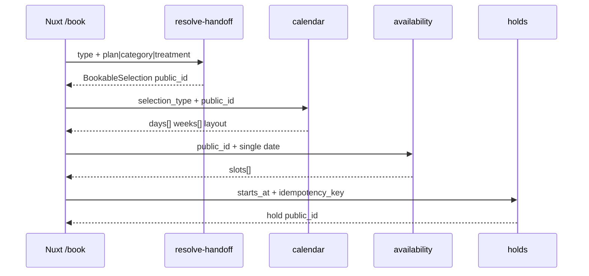

# Calendar Service — Phase 3 Design

**Status:** Design approved for implementation (discussion 2026-07-07)
**Owners:** Backend / booking domain
**Related:** [SERVICES_PAGE_IA.md](./SERVICES_PAGE_IA.md) (handoff & `/book`), [BOOKING_APP_PRODUCTION_BLUEPRINT.md](../BOOKING_APP_PRODUCTION_BLUEPRINT.md), [BOOKING_CAPACITY_BOUNDARY.md](../security/BOOKING_CAPACITY_BOUNDARY.md)

---

## 1. Problem statement

The public booking calendar is the **centerpiece** of the product. Every path from the homepage, `/services`, and `/book` must answer, deterministically:

> For **this exact service**, on **this day**, can we accept a client — and at **what times**?

Phase 2 delivered a thin client and a first backend calendar (`BookingCalendarService`). That implementation is **selection-type aware** (full package vs single), not yet a full **per-service scheduling registry**. Phase 3 formalises the calendar as a **Catalog-Aware Scheduling Service (CASS)** with bounded algorithms, reliability SLOs, and a security contract.

**Non-goal:** Phase 3 does not change hold/checkout/payment truth. The calendar is **read-only optimism**; holds are the lock.

---

## 2. Goals and non-goals

### Goals

| # | Goal |
|---|------|
| G1 | Every marketing bookable item (homepage + services) resolves to a DB catalog row and produces a valid calendar |
| G2 | Calendar shows **only offered weekdays** for the selection (Tue/Wed packages; Mon/Thu–Sat singles) |
| G3 | Roll forward: when this week’s offered days are full, later weeks appear in the bounded window |
| G4 | Deterministic day classification: same inputs → same `status` / `reason_code` |
| G5 | Bounded work per request (no 42-day slot scans on default load) |
| G6 | Two-phase API: calendar summary → per-day slots on tap |
| G7 | Contract tests for every marketing slug + security red-team expansion |
| G8 | Newman acceptance folder for handoff → calendar → availability |

### Non-goals (Phase 3)

- Per-service **weekday overrides** (deferred to Phase 3e unless business requires before launch)
- Per-service **day capacity** different from day-type defaults (3 / 5)
- Staff calendar / manual release UI
- Pricing or checkout logic in calendar responses
- Client-side booking policy (Nuxt must remain a renderer)

---

## 3. Current state (Phase 2 baseline)

### Implemented

| Component | Location | Notes |
|-----------|----------|-------|
| Handoff resolve | `bookings/services/handoff_resolve.py` | `package` / `single` → catalog `public_id` |
| Calendar build | `bookings/services/booking_calendar.py` | 8 offered days, bulk capacity, per-day slots |
| Day classification | `bookings/domain/calendar.py` | Pure `classify_calendar_day()` |
| APIs | `GET /api/bookings/catalog/resolve-handoff/`, `/calendar/`, `/availability/` | Calendar throttled as `availability` |
| Marketing seed | `seed_marketing_catalog` | 3 packages + 20 treatments |
| Frontend | `useBookFlow`, `BookingFloCalendar` | Renders `layout`, `weeks`, `days` only |
| Tests | `test_booking_calendar_api.py`, red-team range reject | Default-range bug fixed 2026-07-06 |

### Gaps (Phase 3 closes)

| Gap | Risk |
|-----|------|
| No `BookableSelection` domain type | Policy logic scattered across resolve + calendar |
| No contract test per marketing slug | Silent catalog drift breaks `/book` |
| Newman does not cover calendar/handoff | Regression undetected in CI |
| No calendar latency gate | Slow path can return under load |
| `CalendarPolicy` not abstracted | Hard to add per-service rules later |
| Resolve-handoff not throttled separately | Enumeration surface |

---

## 4. Domain model

### 4.1 `BookableSelection` (resolved catalog entity)

Immutable value object returned by catalog resolve and consumed by calendar + availability.

```python
@dataclass(frozen=True)
class BookableSelection:
    selection_type: Literal["normal", "full_package"]
    public_id: UUID          # Service.id or FullPackage.public_id
    slug: str                # marketing slug, e.g. classic-full-package
    name: str                # safe_public_text applied
    duration_minutes: int
    policy_profile: Literal["single", "full_package"]  # drives weekday set
```

**Mapping rules (Phase 3a):**

| `selection_type` | `policy_profile` | Offered weekdays |
|------------------|------------------|------------------|
| `full_package` | `full_package` | Tue, Wed (1, 2) |
| `normal` | `single` | Mon, Thu, Fri, Sat (0, 3, 4, 5) |

**Source of truth:** `FullPackage` / `Service` rows synced via `seed_marketing_catalog` (later: staff CMS or import job). Frontend `bookingCatalog.ts` slugs must match DB slugs (enforced by contract tests).

### 4.2 `CalendarPolicy` (date + selection → rules)

```python
class CalendarPolicy:
  @staticmethod
  def for_date(*, selection: BookableSelection, local_date: date) -> CalendarDayPolicy:
      """
      Returns effective policy for this selection on this date.
      Phase 3a: delegates to BookingDayPolicy + policy_profile weekday gate.
      Phase 3e: optional ServiceDayRule override per slug.
      """

@dataclass(frozen=True)
class CalendarDayPolicy:
    day_type: str                    # normal | full_package | closed
    offered: bool                    # is this weekday valid for selection.policy_profile?
    max_clients: int
    normal_bookings_allowed: bool
    full_package_allowed: bool
    business_start: time
    business_end: time
```

### 4.3 `CalendarDayView` (API payload per day)

```python
{
  "date": "2026-07-08",
  "weekday": 2,
  "day_type": "full_package",
  "status": "available",           # available | capacity_full | no_slots | closed
  "reason_code": null,             # wrong_day_type | studio_closed | day_capacity_reached | no_open_times
  "slot_count": 4,
  "capacity": {"max": 3, "booked": 1, "remaining": 2}
}
```

**Note:** `not_offered` days are **omitted** from the response (not rendered as muted Mon–Fri clutter).

### 4.4 Calendar response envelope

```python
{
  "timezone": "Africa/Nairobi",
  "layout": "package_pairs" | "singles",
  "range": {"start": "...", "end": "..."},
  "selection": {"type", "public_id", "slug", "name"},
  "days": [CalendarDayView, ...],      # max CALENDAR_OFFERED_DAYS_COUNT (8)
  "weeks": [{"week_start", "days": [...]}]
}
```

---

## 5. Algorithms

All calendar logic lives in `bookings/services/booking_calendar.py` and `bookings/domain/calendar.py`. The frontend must not duplicate these rules.

### 5.1 Resolve pipeline

```
handoff query (type, plan|category|treatment)
  → resolve_booking_handoff()
  → resolve_catalog_selection(slug)
  → BookableSelection
```

**Invariants:**

- Slug matches `^[a-z0-9-]{1,140}$`
- Row `is_active=True`
- Single: treatment slug must match category keyword rules (`handoff_resolve._service_matches_category`)

### 5.2 Offered-date iterator

```
INPUT:  selection.policy_profile, start=today(Nairobi), horizon=126d, count=8
OUTPUT: list[date] ascending, only offered weekdays

ALGORITHM iter_offered_dates(profile, start, horizon_end, count):
  weekdays ← OFFERED_WEEKDAYS[profile]
  dates ← []
  cursor ← start
  while cursor ≤ horizon_end and len(dates) < count:
    if cursor.weekday() ∈ weekdays:
      dates.append(cursor)
    cursor ← cursor + 1 day
  return dates
```

Constants (`bookings/domain/calendar.py`):

- `CALENDAR_OFFERED_DAYS_COUNT = 8`
- `CALENDAR_SCAN_HORIZON_DAYS = 126`
- `MAX_CALENDAR_RANGE_DAYS = 42` (explicit client range cap only)

### 5.3 Date-range validation

```
IF client sent start_date OR end_date:
  enforce end ≥ start
  enforce (end - start + 1) ≤ 42
ELSE:
  start ← today(Nairobi)
  end ← start + 125 days   # internal scan horizon only
```

**Bug fixed 2026-07-06:** default range must not trip the 42-day cap.

### 5.4 Bulk capacity

```
INPUT: offered_dates[]
OUTPUT: map date → booked_count

ALGORITHM count_blocking_bulk(dates):
  SELECT local_booking_date, COUNT(*)
  FROM bookings
  WHERE local_booking_date IN dates
    AND status IN BOOKING_BLOCKING_STATUSES
    AND NOT (status = HELD AND hold_expires_at ≤ now())
  GROUP BY local_booking_date
```

### 5.5 Slot feasibility (expensive path)

```
dates_needing_slots ← [d for d in offered_dates if booked(d) < policy(d).max_clients]

FOR each d in dates_needing_slots:
  slots[d] ← AvailabilityEngine.day_slots(selection, d)   # single-day call only

FOR each d in offered_dates:
  classify(selection, policy(d), booked(d), len(slots.get(d, [])))
```

**Never** call availability for `capacity_full` days.
**Never** call availability for a range > 14 days in one request (`MAX_AVAILABILITY_RANGE_DAYS`).

### 5.6 Classification (pure)

```
ORDER of checks in classify_calendar_day():
  1. closed / max_clients ≤ 0        → closed
  2. wrong day type for selection    → not_offered (omitted from API days[])
  3. booked ≥ max_clients            → capacity_full
  4. slot_count ≤ 0                  → no_slots
  5. else                            → available
```

### 5.7 Week grouping

```
group_days_into_weeks(days):
  bucket by ISO week (Monday start), preserve chronological order
  layout package_pairs → UI renders 2-column Tue|Wed per week
  layout singles       → responsive grid of offered days only
```

### 5.8 End-to-end flow (sequence)



---

## 6. API contract

| Endpoint | Method | Throttle scope | Auth |
|----------|--------|----------------|------|
| `/api/bookings/catalog/resolve-handoff/` | GET | `catalog_resolve` (60/min IP) | Anonymous |
| `/api/bookings/catalog/resolve/` | GET | `catalog_resolve` (60/min IP) | Anonymous |
| `/api/bookings/calendar/` | GET | `availability` (30/min IP) | Anonymous |
| `/api/bookings/availability/` | GET | `availability` | Anonymous |

### Query parameters

**resolve-handoff**

| Param | Package | Single |
|-------|---------|--------|
| `type` | `package` | `single` |
| `plan` | required slug | — |
| `category` | — | `facials\|massage\|waxing\|makeup` |
| `treatment` | — | optional slug |

**calendar**

| Param | Required |
|-------|----------|
| `selection_type` | yes |
| `service_public_id` or `full_package_public_id` | yes |
| `start_date`, `end_date` | optional (explicit range ≤ 42 days) |
| `resource_public_id` | optional |

**availability**

| Param | Required |
|-------|----------|
| same as calendar | yes |
| `start_date` = `end_date` | single day |

### Error semantics (anonymous)

| Condition | HTTP | Body |
|-----------|------|------|
| Bad slug / handoff | 400 | `{"detail": "Selection unavailable."}` |
| Bad calendar input | 400 | `{"detail": "Calendar unavailable."}` |
| Throttled | 429 | generic, `Retry-After` |
| Never | 500 with internals | use generic 400 |

---

## 7. Reliability and “will not go down”

Reliability means **bounded work**, **graceful degradation**, and **no false availability** — not 100% uptime magic.

### 7.1 SLO targets

| Operation | p95 target | Hard limit |
|-----------|------------|------------|
| `resolve-handoff` | < 100 ms | 1–2 DB queries |
| `calendar` (default) | < 2 s | ≤ 8 single-day slot calls |
| `availability` (1 day) | < 500 ms | 1 day, ≤ 14-day range |

**CI:** add `tests/latency/test_calendar_service_latency.py` in Phase 3c.

### 7.2 Degradation matrix

| Failure | User-visible behaviour |
|---------|------------------------|
| DB timeout | 400 `Calendar unavailable.` |
| No active resources | `no_slots` on offered days |
| Redis unavailable | skip cache; throttle fail-safe per existing policy |
| Invalid UUID | same generic 400 as unknown slug |

### 7.3 Caching (Phase 3c — optional)

```
cache_key = sha256(selection_public_id, offered_dates_hash, capacity_generation)
TTL = 30–60 seconds
invalidate on: hold created/confirmed/cancelled affecting local_booking_date
```

**Rule:** stale `available` is worse than slow. Version capacity generation or skip cache until hold path is stable.

### 7.4 Observability

Structured logs (no PII):

- `calendar.build` — slug, days_count, status histogram, duration_ms
- `calendar.resolve` — handoff type, slug, success/fail
- Alerts: p95 > SLO, 5xx rate, throttle spike

### 7.5 Horizontal scaling

Calendar service is **stateless**. Scale Gunicorn workers + Postgres connection pool. No sticky sessions.

---

## 8. Security

Calendar is public, read-only, **enumeration-prone**, and **CPU-expensive**.

### 8.1 Threat matrix

| Threat | OWASP API | Mitigation | Test |
|--------|-----------|------------|------|
| Slug path traversal | API8 | `SLUG_RE`, allowlist handoff types | `test_handoff_resolve`, red-team |
| UUID probing / BOLA | API1 | active rows only; generic 400 | catalog resolve tests |
| Oversized date range DoS | API4 | 42-day explicit cap | `test_booking_calendar_red_team` |
| Algorithmic DoS (slot scan) | API4 | 8-day default, skip full days | latency tests |
| Scraping / enumeration | API6 | 30/min throttle (`availability`) | throttle semantics |
| XSS in service names | API3 | `safe_public_text()` | calendar API tests |
| Price/capacity tampering via GET | — | no writable fields on GET | response privacy matrix |
| Cache poisoning | — | no user input in cache keys | design review |

### 8.2 Response allowlist

**Permitted in calendar JSON:**

- `timezone`, `layout`, `range`, `selection` (type, public_id, slug, name)
- `days[]`: date, weekday, day_type, status, reason_code, slot_count, capacity
- `weeks[]`: week_start, days

**Forbidden:**

- `base_price`, `amount`, internal PKs, staff IDs, customer PII, hold IDs, provider refs, raw policy notes

### 8.3 Rate limiting

Current: calendar uses `@route_throttle("availability")` → `30/min` per IP (`core/settings.py`).

Phase 3d options:

- Split `calendar` into its own scope (e.g. `20/min`) if abuse observed
- Keep resolve-handoff on stricter `catalog_resolve` scope

### 8.4 Integrity boundary

| Layer | Authority |
|-------|-----------|
| Calendar | optimistic read |
| Hold | pessimistic lock + overlap constraint |
| Checkout | payment truth |

Calendar must never imply confirmed booking or final price.

---

## 9. Catalog registry (every service the site knows)

### 9.1 Marketing inventory

**Packages (3)** — `policy_profile: full_package`

| Slug | Duration |
|------|----------|
| `classic-full-package` | 240 min |
| `glow-package` | 180 min |
| `relax-package` | 150 min |

**Singles (20)** — `policy_profile: single`

| Category | Treatments (slug = slugify name) |
|----------|----------------------------------|
| facials | deep-cleansing-facial, brightening-facial, hydrating-facial, express-facial, anti-ageing-rejuvenation |
| massage | swedish-massage, deep-tissue-massage, back-neck-and-shoulders, hot-stone-massage |
| waxing | brow-shaping, upper-lip-and-chin, underarms, half-leg, full-leg, bikini-and-brazilian, full-body-wax |
| makeup | everyday-makeup, soft-glam, bridal-and-event-glam, evening-and-photography-makeup |

### 9.2 Sync contract

1. `frontend/src/landing/bookingCatalog.ts` — static allowlist for handoff URL validation
2. `seed_marketing_catalog` — DB rows for resolve + calendar
3. **Phase 3a test:** `tests/api/test_marketing_catalog_contract.py` — every frontend slug exists in DB and resolves

Drift between (1) and (2) fails CI.

---

## 10. Test matrix

### 10.1 Unit / domain

| Test file | Covers |
|-----------|--------|
| `test_calendar_domain.py` | `classify_calendar_day`, `iter_offered_dates` |
| `test_booking_calendar_api.py` | build_calendar, API JSON, roll-forward, default range |
| `test_handoff_resolve.py` | package + single handoff |
| `test_booking_calendar_red_team.py` | oversized range, path traversal |

### 10.2 Contract (Phase 3a — add)

```python
@pytest.mark.parametrize("plan", PACKAGE_PLAN_SLUGS)
def test_every_package_slug_resolves_and_calendars(plan): ...

@pytest.mark.parametrize("category,treatment", TREATMENT_CASES)
def test_every_treatment_slug_resolves_and_calendars(category, treatment): ...
```

Each case:

1. `resolve-handoff` → 200
2. `calendar` (no dates) → 200, `len(days)==8`, weekdays ⊆ offered set
3. At least one day with `status in (available, capacity_full, no_slots)` — not all closed

### 10.3 Newman (Phase 3d — add folder)

```
06 Calendar and Handoff
  ├── Resolve package classic-full-package
  ├── Calendar for package (assert layout package_pairs)
  ├── Resolve single brow-shaping
  ├── Calendar for single (assert layout singles)
  ├── Availability single day (tap simulation)
  └── Negative: oversized calendar range → 400
```

### 10.4 Latency (Phase 3c — add)

```python
def test_calendar_default_range_under_budget():
    # p95 < 2s with factory resource + 8 offered days
```

### 10.5 Security passive

- ZAP Newman mode already proxies booking routes; extend URL list when Newman folder added.

---

## 11. Implementation phases

| Sub-phase | Deliverable | Depends on |
|-----------|-------------|------------|
| **3a — Registry & contracts** | `BookableSelection`, marketing contract tests, slug drift CI | seed_marketing_catalog |
| **3b — Policy engine** | `CalendarPolicy.for_date()`, refactor `BookingCalendarService` | 3a |
| **3c — Performance** | Latency gate, optional Redis cache + invalidation hooks | 3b |
| **3d — Security & Newman** | Newman folder, resolve throttle scope, expanded red-team | 3a |
| **3e — Per-service overrides** | `ServiceDayRule` model (only if business requires) | 3b |

**Recommended order:** 3a → 3b → 3d (parallel) → 3c → 3e (if needed).

### 3e task checklist

- [x] Add `ServiceDayRule` model + migration (`0020_service_day_rule_phase_3e`)
- [x] `CalendarPolicy.for_date()` applies per-slug overrides when active rows exist
- [x] `offered_weekdays_for_selection()` merges type defaults with rule adjustments
- [x] Tests: default unchanged, override paths, public API cannot write rules
- [x] **Product decision locked: Option A** — type-level policy only; **zero** seeded `ServiceDayRule` rows; every service follows package/single rules (`bookings/domain/cass_policy.py`, `tests/security/test_cass_policy_option_a.py`)

### 3a task checklist

- [x] Add `bookings/domain/selection.py` with `BookableSelection`
- [x] Add `bookings/domain/marketing_catalog.py` as single slug registry
- [x] Refactor `resolve_catalog_selection` to return typed selection
- [x] Add `tests/api/test_marketing_catalog_contract.py`
- [x] Document slug sync in `tests/postman/README.md`

### 3b task checklist

- [x] Add `bookings/domain/calendar_policy.py` with `CalendarPolicy`
- [x] `BookingCalendarService` uses `CalendarPolicy` only (no inline weekday checks)
- [x] Remove duplicated policy knowledge outside domain

### 3c task checklist

- [x] `tests/latency/test_calendar_service_latency.py`
- [x] Optional: `CalendarCache` with hold invalidation

### 3d task checklist

- [x] Newman folder `06 Calendar and Handoff`
- [x] `@route_throttle("catalog_resolve")` on resolve-handoff
- [x] Expand `test_booking_calendar_red_team.py` (malformed UUID, inactive service)

---

## 12. Frontend responsibilities (unchanged)

| Responsibility | Owner |
|----------------|-------|
| Parse handoff query (allowlist only) | `bookingHandoff.ts` |
| Resolve + calendar + availability fetch | `bookingPublicApi.ts` |
| Render `weeks` / `layout` | `BookingFloCalendar.vue` |
| Slot chips on day tap | `BookingFloSlots.vue` |
| Day policy / capacity rules | **Backend only** |

---

## 13. Open decisions (product)

| # | Question | Default recommendation |
|---|----------|------------------------|
| D1 | Any treatment with non-standard weekdays? | **No** — type-level (approved 2026-07-07) |
| D2 | Per-service day capacity? | **No** — 3/5 by day type (approved) |
| D3 | Redis cache on calendar? | **Yes** — after 3c latency baseline (approved) |
| D4 | Show `capacity_full` days or skip them? | **Show disabled** + roll-forward (approved) |
| D5 | Newman calendar folder in acceptance? | **Yes** (approved) |

---

## 14. Success criteria (Phase 3 complete)

- [x] All 23 marketing slugs pass contract test (resolve + calendar)
- [x] Newman folder green in Docker CI
- [x] Calendar p95 < 2s under latency test
- [x] Efficiency contract: [`BACKEND_DSA_EFFICIENCY.md`](./BACKEND_DSA_EFFICIENCY.md) (batched slots, query/latency gates, capacity invalidation)
- [ ] Turbo Pass + ZAP passive green (re-run after venv repair; initial run failed on broken `.venv`)
- [ ] `/book?type=package&plan=classic-full-package` loads Tue/Wed weeks < 2s on local Docker
- [ ] No booking policy logic in `frontend/src/booking/` beyond response validation
- [x] This document updated with implementation status (efficiency slice; FE/ZAP items remain)

---

## 15. References

| Doc | Relevance |
|-----|-----------|
| `bookings/domain/calendar.py` | Constants, iterator, classifier |
| `bookings/services/booking_calendar.py` | Orchestration |
| `bookings/services/handoff_resolve.py` | Handoff → slug |
| `bookings/management/commands/seed_marketing_catalog.py` | Catalog sync |
| `docs/security/RATE_LIMIT_ABUSE_MATRIX.md` | Throttle policy |
| `docs/security/BOOKING_CAPACITY_BOUNDARY.md` | Capacity vs rate limit |
| `docs/testing/CI_TEST_MATRIX.md` | Partition strategy |
| `reports/ci/full-verification-report-20260706.md` | Last full verification run |
