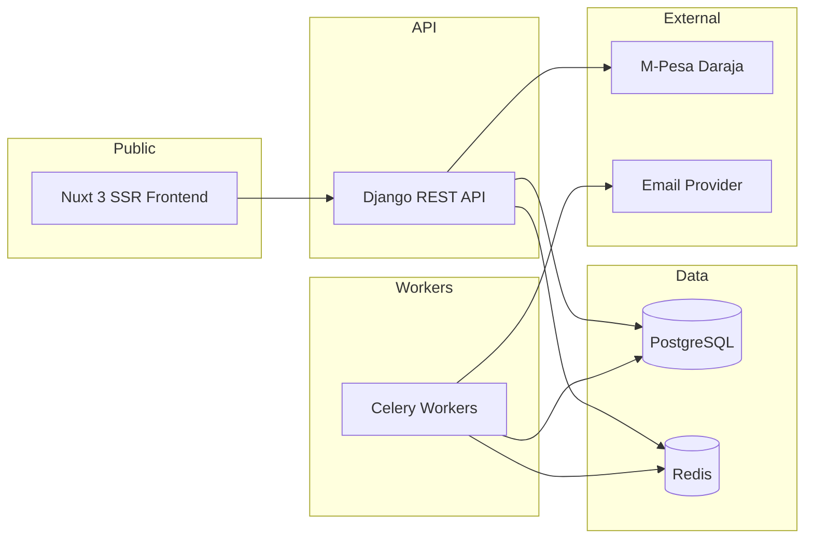

# AestheticOS — Portfolio Showcase

> **Safe for public GitHub.** Copy this folder to a public repo (e.g. `ALEX-MUTHOMI/aesthetic-os-showcase`) or paste sections into your profile README. No secrets, no payment logic, no exploitable implementation detail.

## Elevator pitch

**AestheticOS** is a full-stack **spa & aesthetics booking platform** I built as a production-minded monorepo: public portfolio, appointment scheduling, M-Pesa payments, staff portal, and an immutable billing ledger — with security testing treated as a first-class concern.

**Tagline:** *The booking operating system for aesthetics businesses.*

---

## Problem

Aesthetics and spa businesses need more than a brochure site:

- Showcase work without leaking raw uploads
- Take bookings with real capacity rules (no double-booking)
- Accept mobile money (M-Pesa) reliably under webhook retries and duplicates
- Give staff a secure operations portal without exposing customer PII casually
- Keep financial records auditable and separate from booking UI state

---

## Solution

AestheticOS splits the system into bounded contexts:

| Module | Responsibility |
|--------|----------------|
| **Bookings** | Catalog, availability, holds, lifecycle, gallery, staff workflows |
| **Checkout** | Payment orchestration, M-Pesa STK, webhooks, idempotency |
| **Billing** | Immutable ledger, settlements, financial audit events |
| **Core** | Auth, throttling, Celery, security headers, OpenAPI |

---

## Architecture (high level)



**Key design choices (what recruiters care about):**

1. **PostgreSQL exclusion constraints** — overlap protection at the database layer, not only in Python
2. **Checkout ↔ Billing contract** — booking state never directly mutates ledger truth
3. **Webhook inbox + idempotency** — duplicate M-Pesa callbacks cannot double-credit
4. **Response privacy** — staff/customer APIs redact fields by role and context
5. **Defense in depth** — Turnstile, CSRF, rate limits, abuse circuit breaker, 100+ security tests

---

## Tech stack

| Area | Choices |
|------|---------|
| Backend | Python 3.13, Django 6, DRF |
| Frontend | Nuxt 3 (SSR), Vue 3, Pinia, TypeScript |
| Database | PostgreSQL 16 |
| Queue / cache | Redis 7, Celery (billing, receipts, gallery, auth queues) |
| Payments | Safaricom M-Pesa via Daraja API |
| Bot protection | Cloudflare Turnstile |
| Testing | pytest, Playwright, Newman/Postman, OWASP ZAP (CI), load & chaos suites |
| Deploy | Docker multi-stage builds, GitHub Actions |

---

## Features demonstrated

- [x] Public portfolio gallery with optimized variants (originals stay private)
- [x] Service catalog, bundles, and day-capacity policies
- [x] Atomic booking holds with expiry
- [x] M-Pesa STK push + callback normalization
- [x] Immutable billing ledger and settlement records
- [x] PDF receipts and email outbox with retry/DLQ
- [x] Staff portal (dashboard, bookings, gallery upload, payments view)
- [x] Customer OTP for sensitive actions (reschedule, etc.)
- [x] Legal/policy acceptance flows
- [x] CI pipeline with lint, security scan, integration, and Docker build gates

---

## Code snippet (sanitized)

Illustrative pattern only — shows **separation of concerns**, not production secrets or full business logic.

```python
# bookings/services/checkout_contract.py (conceptual excerpt)
def promote_booking_after_payment_success(booking, checkout_session):
    """
    Booking may react to checkout outcomes; ledger writes stay in billing/.
    """
    if checkout_session.status != "succeeded":
        raise PaymentNotCompleteError()

    booking.transition_to("confirmed")
    billing.record_settlement_from_checkout(checkout_session)
```

```typescript
// frontend: SSR + security modules (nuxt.config.ts excerpt)
export default defineNuxtConfig({
  ssr: true,
  modules: ['@nuxtjs/turnstile', 'nuxt-csurf', 'nuxt-security'],
})
```

More patterns: [SNIPPETS.md](./SNIPPETS.md)

---

## Security & why the main repo stays private

| Public full source | Private source + this showcase |
|--------------------|--------------------------------|
| Attackers can map every endpoint and auth bypass idea | Attack surface for **reconnaissance** is much smaller |
| Committed secrets become permanent | Production integration details stay off GitHub |
| Fine for tutorials | Right for **payments + PII + staff portal** |

**Industry-standard approach:** private production repo + public portfolio that proves scope, architecture, and engineering judgment.

---

## What to tell recruiters

> "I built **AestheticOS**, a booking operating system for aesthetics businesses — Django and Nuxt, M-Pesa payments, PostgreSQL capacity constraints, immutable billing, and a large automated security test matrix. The production codebase is private; I can walk through architecture, tradeoffs, and demos on request."

**Demo options (you provide):**

- Screenshots / Loom walkthrough of public site + staff portal
- Live staging URL (if deployed)
- Architecture discussion in interview
- Code review on request under NDA

---

## Suggested public repo setup

1. Create **`ALEX-MUTHOMI/aesthetic-os-showcase`** (public)
2. Copy only this `showcase/` folder + 2–3 screenshots
3. Pin it on your GitHub profile next to your other public projects
4. Link from LinkedIn/CV: `github.com/ALEX-MUTHOMI/aesthetic-os-showcase`
5. Keep **`aesthetic-os`** (renamed private repo) for actual development

---

## Contact

**Alex Muthomi** · GitHub: [@ALEX-MUTHOMI](https://github.com/ALEX-MUTHOMI)
